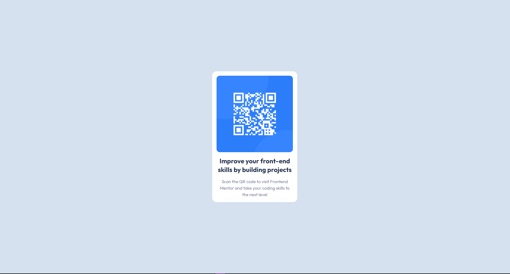

# Frontend Mentor - QR Code Component Solution

This is a solution to the [Product preview card component challenge on Frontend Mentor](https://www.frontendmentor.io/challenges/qr-code-component-iux_sIO_H). Frontend Mentor challenges help you improve your coding skills by building realistic projects.

## Table of contents

- [Overview](#overview)
  - [The challenge](#the-challenge)
  - [Screenshot](#screenshot)
  - [Built with](#built-with)
  - [Links](#links)
- [Author](#author)

## Overview

I'll probably finish all newbie challenges before I move on with the harder ones. My goal for this month will be finishing all html&css challenges before I move on with the js challenges. I'll do 2 challenges per day since I think most of the challenges with only html and css are easy enough. This gives me a chance to really get myself versed with frontend web development. Also, if you think you already know most of the basics in css, I'd recommend you to use tailwindcss! It gives you an easier time developing frontend stuff, although I don't know if companies use these types of libraries but I do hope so once I apply hehe.

### The challenge

Users should be able to:

- View the optimal layout for the interface depending on their device's screen size
- See hover and focus states for all interactive elements on the page

### Screenshot

### Links

Site Link: https://product-preview-card-component-main-solution-eight.vercel.app

### Built with

- Semantic HTML5 markup
- Grid
- Flexbox
- CSS Grid
- TailwindCSS

# Author

- Frontend Mentor - [@kohicha](https://www.frontendmentor.io/profile/kohicha)
- Twitter - [@eepykohi](https://twitter.com/eepykohi)
